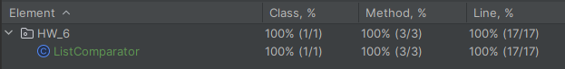

### Задание 1. Создайте программу на Python или Java, которая принимает два списка чисел и выполняет следующие действия:

a. Рассчитывает среднее значение каждого списка.

b. Сравнивает эти средние значения и выводит соответствующее сообщение:
- ""Первый список имеет большее среднее значение"", если среднее значение первого списка больше.
- ""Второй список имеет большее среднее значение"", если среднее значение второго списка больше.
- ""Средние значения равны"", если средние значения списков равны.

#### Отчет о выполнении задания:
- [Код программы]()
- [Код тестов]()
- Отчет о покрытии тестами
  
  - Объяснение того, какие сценарии покрыты тестами и почему выбрали именно эти сценарии:
  ```
  Сценарии, покрытые тестами:
  
  1. Сравнение двух списков с разными значениями.
  2. Сравнение двух списков с одинаковыми значениями.
  3. Сравнение списка с пустым списком.
  4. Сравнение пустого списка с другим списком.
  
  Я выбрал эти сценарии, чтобы убедиться, что программа правильно рассчитывает среднее значение каждого списка и сравнивает их.
  Также я проверил случай с пустым списком, чтобы убедиться, что программа обрабатывает такие случаи корректно.
  ```